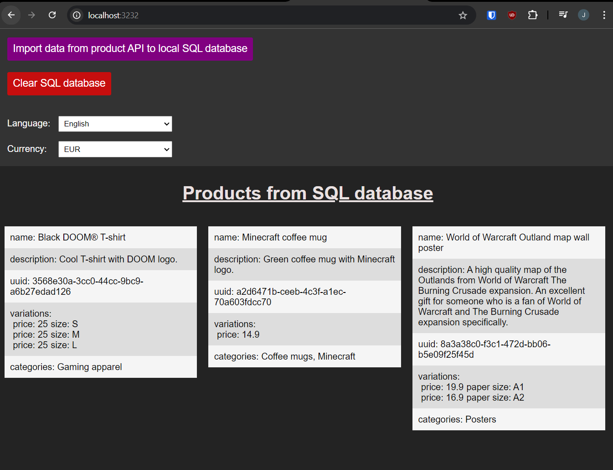
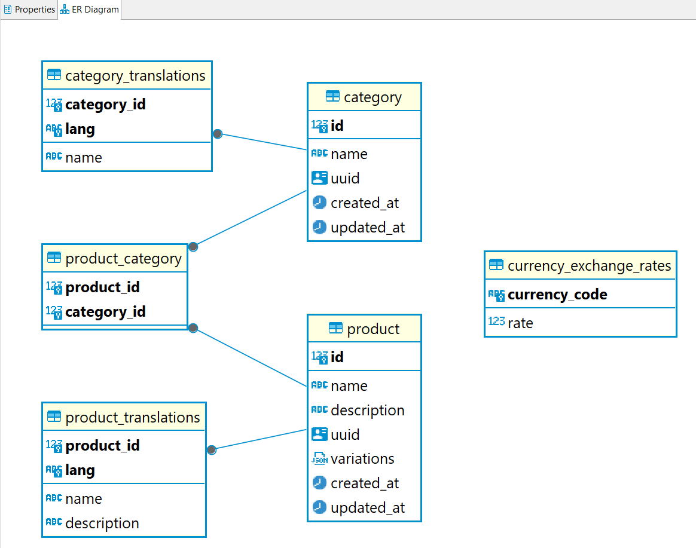

# developer-test-3a

## Running the code

### Requirements

- `docker` and `docker compose` must be installed

- Ports 3131, 3232 and 3434 must not be reserved on the host 

### Commands

- Run `docker compose up` to start the environment (or `docker compose up -d` to start it in the background)

### Urls

- Open `http://localhost:3232` to view the web ui

- Open `http://localhost:3434` to open Adminer and browse the PostgreSQL database:

  - Database type: PostgresSQL

  - Server: `db`

  - Username: `dev`

  - Password: `dev`

  - Database name: `app`

- `http://localhost:3131` is just for the API between client and server

### Web UI

- Through the UI you can:

  - Request the server to import the data from the product API

  - Clear data from the SQL database

  - Change language (but you would need to insert finnish translations to the database for it to actually do anything, it fallbacks to the original language if no translation is available)

  - Change currency: This changes the prices of the variations based on an exchage rate stored in database

  - View the product data in the SQL database in a very basic format

## Automated tests

- Currently there are a few integration/API tests to check that e.g. data import, currencies and translations work as expected

- I used Jest as the test runner because I have previous experience with it

- For a real-world project, additional tests could be added to ensure everything works as expected, depending on factors such as the project's criticality and the potential impact of bugs

- run `./run-api-tests.sh` to start tests

## Implementation

### Technologies

- Since the requirement was to save the data to SQL database, I decided to set up an environment with Docker to make it portable

- For database I used PostgreSQL because that's what I have used the most lately

- I chose TypeScript as the main language. Given the choice between vanilla JavaScript and TypeScript, I would always opt for TypeScript. The minimal overhead of writing types is well worth it, as it reduces cognitive load for developers by eliminating the need to constantly re-check everything. It also reduces bugs, makes refactoring easier, and helps onboarding new developers to the project.

- For querying the database I used the Nodejs SQL query builder package [Kysely](https://github.com/kysely-org/kysely). I used this because I have read about it and wanted to give it a try.

  - For a larger project a full ORM could be a good alternative to make development faster (although you lose some control over the generated SQL vs query builder)

- While it was not in the requirements, I decided to implement a simple frontend with React

  - I needed some way to trigger the import from the product API anyway and a web UI seemed like a nice, user friendly solution

    - Another option would have been some kind of command line utility 

  - Why React? Lately, I have used mostly Angular and it's been a while since I made anything with React, so wanted to see what's new and if I still remember how to use it. In the end, the UI is so simple that I didn't really get to do anything interesting with React and could have implemented it in plain Javascript/HTML/CSS also.

    - Since I haven't used React in a while, I'm not entirely sure that everything in the implementation follows best practices. If I were to use React in a real-world project, I would first spend some time re-learning modern React, studying best practices, and, if possible, seeking feedback from my peers.

### Database design

#### Structure

- I decided to use six tables:

  - product

  - product_translations (translations for translatable product fields)

  - category

  - category_translations (translations for translatable category fields)

  - product_category (links products to categories)

  - currency_exchange_rates (support for extra currencies through conversion)

- Given more specific requirements I might have come up with another design, but this should be quite scalable and fill the requirements as far as I understood them from the specs

- With a larger data set there might be a need to add some indexes to make the queries perform better. But this depends heavily on the actual use case of the database and how the data needs to be queried

#### Saving only parts that have changed 

- Given the limited specs available (I did this over weekend, so couldn't ask more details with email), I had to make some assumptions here

- The instructions said:

  - "How to update the product data from the API without re-saving everything but only parts that have changed" 

  - "Also note that not every object have IDs" 

- Which to me suggests that I need to have some way to identify a resource for update.

- And since apparently not every object has an ID, I can't use the id/uuid (although every object in the sample data does have an uuid)

- For this reason I decided to do the updates based on product/category name and assumed it is an unique identifier of the resource

- If every object has an ID/uuid, then of course that is what should be used since there could e.g. be different products with the same name

- I did implement some basic logic to only update product/category if some of it's values are changed

  - I didn't see the point of doing it more granularly, since we are making the DB update request at that point anyway.

#### Schemaless data (variations)

- Task: "Figure a way to handle schemaless data (variations)"

- For this I used a JSON field in the SQL database

#### Currencies

- Task: "Add support for extra currencies"

- Wasn't sure what exactly the requirements here were, but I created a currency exchange rates table where you can set exchange rates for other currencies

- The prices can then be set based on the exchange rate of the selected currency when products are fetched from the db

## Final thoughts

- Overall the test was a fun little project and made me think about the solution for a bit. Once I got started, I kinda wanted to continue working with it.

- I'm quite happy with the results, but if there is one thing I would do differently in a real-world project, it would be to really get a good understanding of what we are building, why, and what the system must be able to accomplish. This ensures that we, as developers, can make the right architecture and technology decisions to deliver a working product to the customer.

- Other than that, I might choose an ORM (e.g. Sequelize) to handle some of the heavy lifting with the database. I might also opt for Nest.js instead of Express for the backend, as I believe a structured framework can make maintaining the codebase easier, especially when multiple developers are working on the same project.

- And of course, more automated tests could always be added if there is time in the project. I believe that even if there’s a slight chance the project will become more complex in the future, the overhead of writing unit, integration, and end-to-end tests from the beginning will pay off later. Additionally, I would add some linting rules to enforce a consistent coding standard, and using a static code analysis tool like SonarQube would be beneficial for the project's long-term health (e.g., forbidding overly long functions, catching subtle bugs, etc.).